# TaskPro

## About

TaskPro is a mobile app developed using React Native and Firebase, designed to help users manage responsibilities such as tasks, events and group events in a single platform. A full demonstration of the application can be found in the [demonstration video](https://github.com/chengjingling/taskPro/blob/main/Demonstration%20Video.mp4).

## Types of responsibilities

### Tasks

A task is a piece of work that has a deadline and can be marked as complete.

Example: Check emails by `29 Aug 2024 10am`.

### Events

An event is an activity that has a start and end datetime.

Example: Training course from `29 Aug 2024 2pm` to `29 Aug 2024 4pm`.

### Group events

A group event is an activity that has a start and end datetime, and involves multiple participants.

Example: Meeting from `29 Aug 2024 5pm` to `29 Aug 2024 6pm` with Alice, Bob, Carly, David and Emily.

## Login screen

    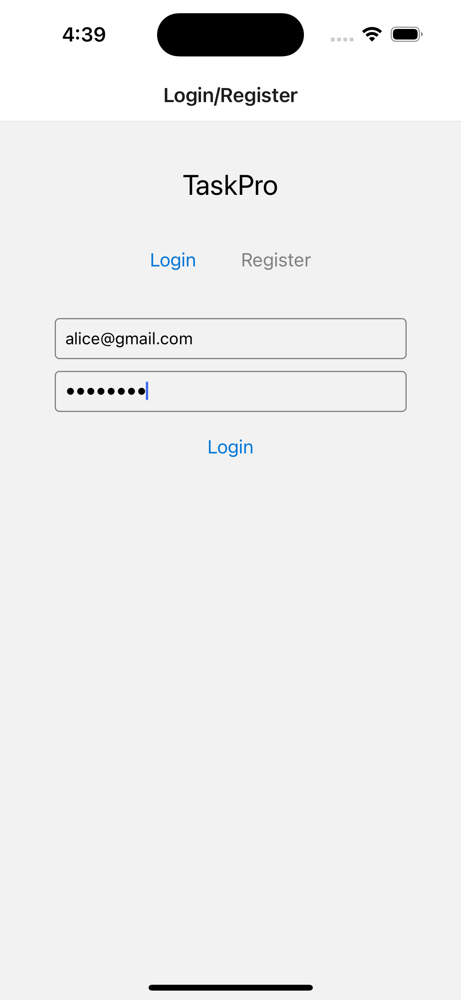

When the app is run, the user lands on the Login screen. Users with an account can enter their email and password to log in.

Validation checks are put in place to detect invalid inputs, such as missing fields or mismatched credentials. If all inputs are valid, the user is logged in successfully.

## Register screen

    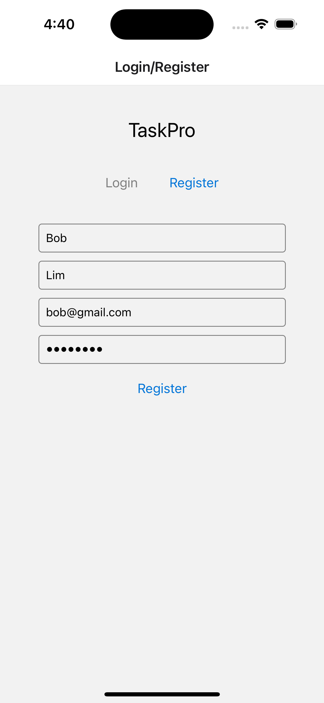

When the user clicks on the "Register" tab in the Login screen, they are redirected to the Register screen. Users without an account can enter their first name, last name, email and password to register.

Validation checks are put in place to detect invalid inputs, such as missing fields or existing email. If all inputs are valid, the user is registered successfully and they are automatically logged in.

## Calendar screen

    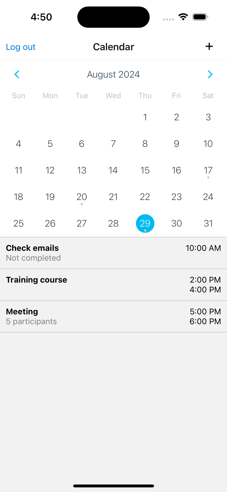

Upon login, the user is redirected to the Calendar screen. Users can click on a date to view the items of the day, sorted according to the time of occurrence. They can click on the "+" button to create a new item, click on an existing item to view more details, or click on the "Log out" button to log out of their account.

## New Item screen - task

    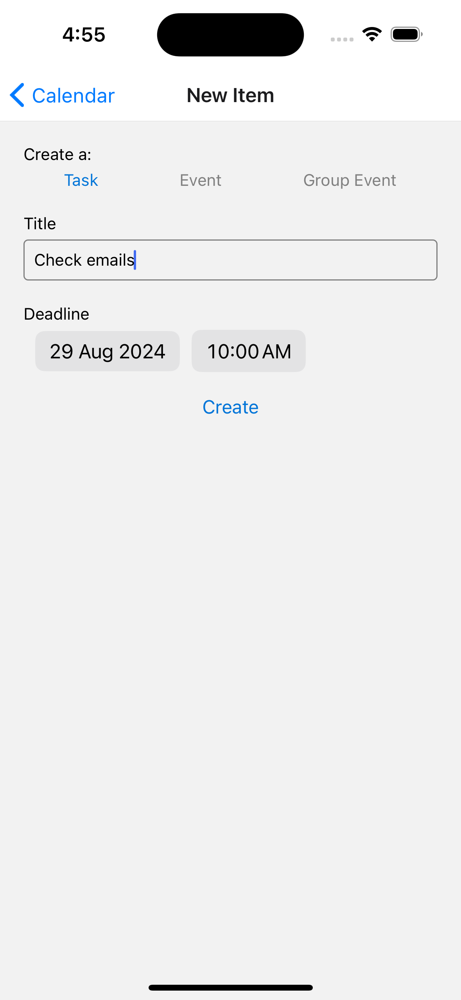

When the user clicks on the "+" button in the Calendar screen, they are redirected to the New Item screen. Users can enter the title and deadline to create a new task.

Validation checks are put in place to detect invalid inputs, such as missing fields. If all inputs are valid, the task is created successfully.

## New Item screen - event

    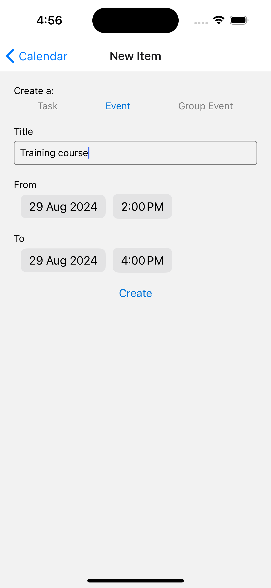

When the user clicks on the "Event" button in the New Item screen, they can enter the title, from date and to date to create a new event.

Validation checks are put in place to detect invalid inputs, such as missing fields or from date later than to date. If all inputs are valid, the event is created successfully.

## New Item screen - group event

    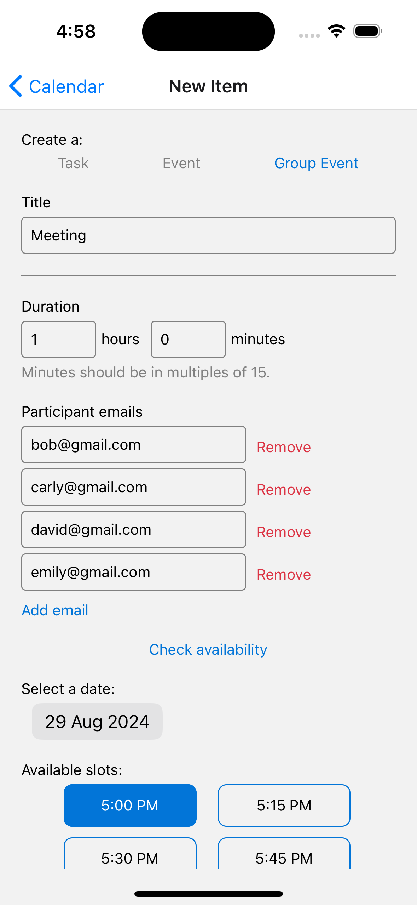
    &nbsp;&nbsp;&nbsp;&nbsp;&nbsp;
    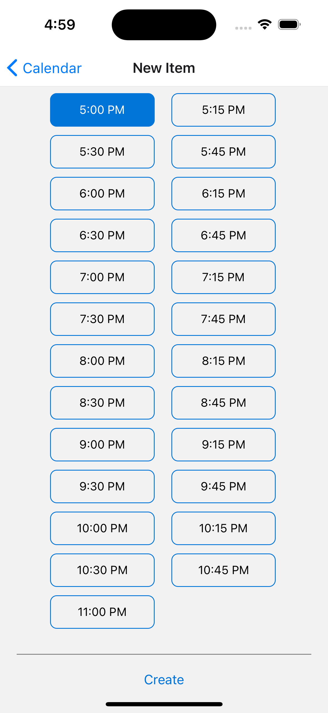

When the user clicks on the "Group Event" button in the New Item screen, they can enter the title, duration and participant emails and click on the "Check availability" button. The application then checks the schedules of all the participants and displays the available time slots based on the date selected. Finally, the user can select a time slot to create the group event.

Validation checks are put in place to detect invalid inputs, such as missing fields or non-existing participant emails. If all inputs are valid, the group event is created successfully.

## Item Details screen - task

    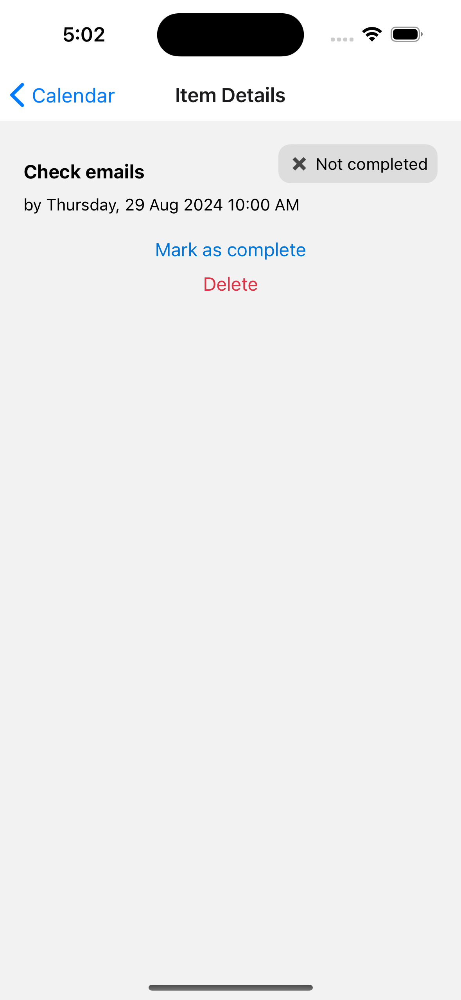
    &nbsp;&nbsp;&nbsp;&nbsp;&nbsp;
    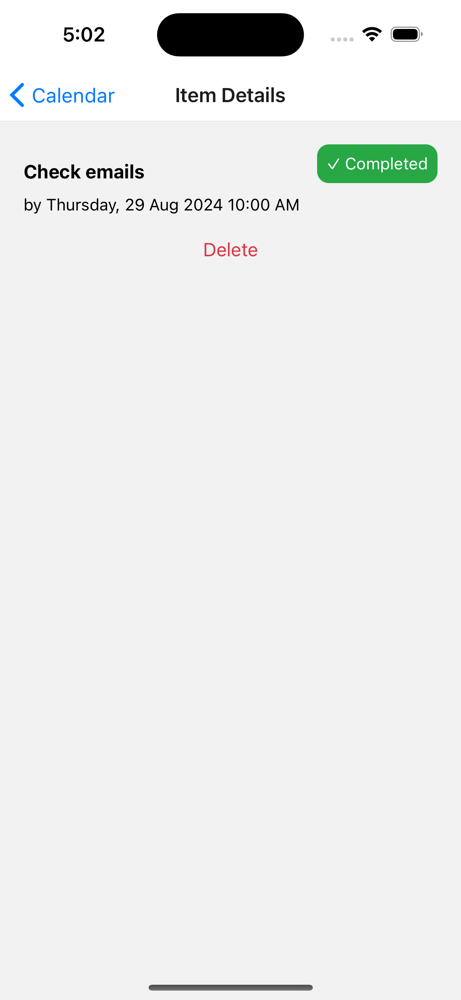

When the user clicks on a task in the Calendar screen, they are redirected to the Item Details screen. Users can view details of the task such as title, deadline and status. They can click on the "Mark as complete" button to mark the task as complete, or click on the "Delete" button to delete the task.

## Item Details screen - event

    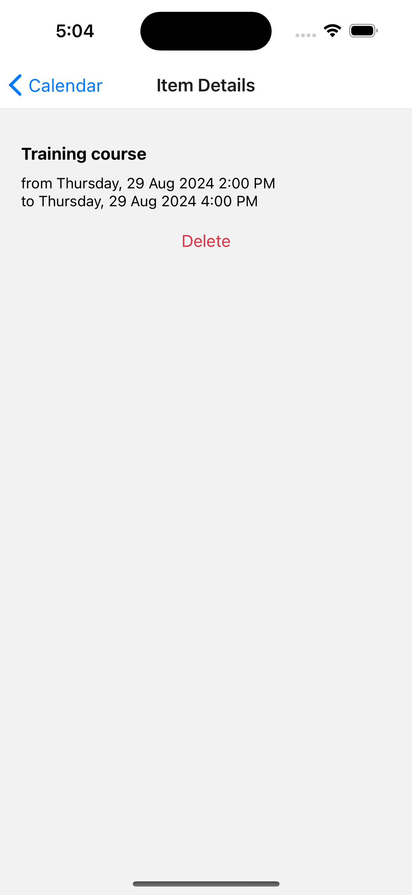

When the user clicks on an event in the Calendar screen, they are redirected to the Item Details screen. Users can view details of the event such as title, from date and to date. They can click on the "Delete" button to delete the event.

## Item Details screen - group event

    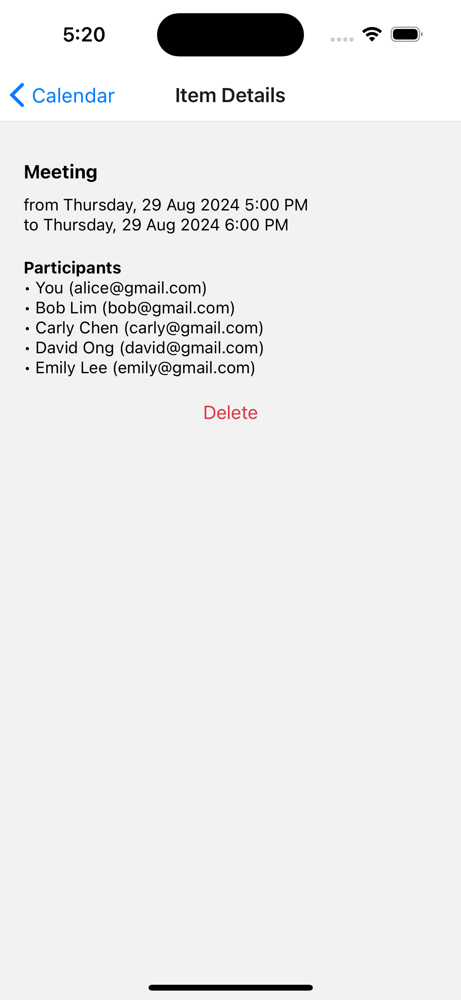

When the user clicks on a group event in the Calendar screen, they are redirected to the Item Details screen. Users can view details of the group event such as title, from date, to date and participants. They can click on the "Delete" button to delete the group event.
